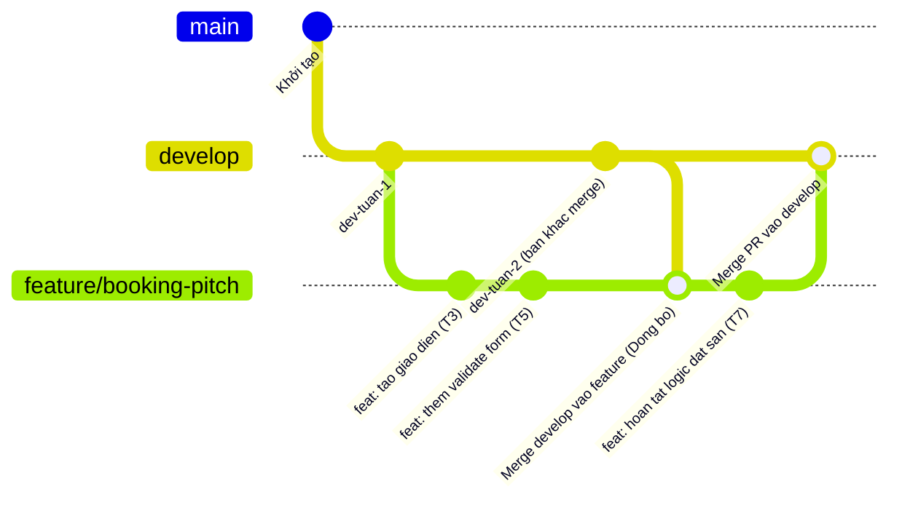

# GIT WORKFLOW GUIDE
## Hướng Dẫn Quy Trình Làm Việc Git Trong Nhóm & Đồ Án Môn Học

---

## 1. Tổng Quan: Hai Cách Tiếp Cận Khi Làm Việc Nhánh

Khi làm việc theo nhóm với các nhánh tính năng (`feature/...`), có hai trường phái chính để cập nhật code mới từ `develop`:

| Tiêu chí | 🟢 Cách Thông Thường (Merge Workflow) | 🟡 Cách Tuyến Tính (Rebase Workflow) |
| :--- | :--- | :--- |
| **Mục đích chính** | **Bảo toàn 100% mốc thời gian (timeline)**, ghi nhận tiến độ thực tế, an toàn làm việc nhóm. | Làm đồ thị commit thẳng tắp, không có commit merge chéo (Linear History). |
| **Lệnh đồng bộ** | `git merge origin/develop` (hoặc `git pull`) | `git rebase origin/develop` |
| **Lệnh Push** | `git push origin feature/...` (Push thông thường) | `git push --force-with-lease` (Bắt buộc Force Push) |
| **Mã Hash (SHA)** | **Giữ nguyên vẹn** toàn bộ commit gốc. | Bị thay đổi hoàn toàn (tạo commit mới). |
| **Thời gian commit** | **Chính xác theo thời điểm làm bài thực tế**. | Có thể bị thay đổi Committer Date; GitHub vẫn ghi nhận vết "force-pushed". |
| **Phù hợp nhất với** | **Đồ án sinh viên, bài tập lớn, nộp bài thầy cô kiểm tra tiến độ**. | Môi trường doanh nghiệp yêu cầu strict linear history. |

> [!IMPORTANT]
> **Khuyến nghị cho Đồ án / Bài tập lớn**:
> Các thầy cô thường kiểm tra lịch sử commit để đánh giá sự chăm chỉ và tiến độ phân bổ công việc theo tuần (tránh trường hợp dồn vào ngày chót nộp bài). Do đó, **Quy trình Thông Thường (Merge Workflow)** là giải pháp an toàn, minh bạch và tự nhiên nhất.

---

## 2. Quy Trình Làm Việc Thông Thường (Khuyên Dùng - Giữ Timeline & Tiến Độ)



### Bước 1: Tạo nhánh tính năng từ `develop` mới nhất

Luôn đảm bảo nhánh `develop` ở máy bạn đang là bản mới nhất trên Remote trước khi rẽ nhánh:

```bash
# 1. Chuyển sang develop và cập nhật mới nhất
git checkout develop
git pull origin develop

# 2. Tạo và chuyển sang nhánh tính năng mới
git checkout -b feature/ten-tinh-nang
```
*Ví dụ:* `git checkout -b feature/pitch-schedule`

---

### Bước 2: Viết code và commit thường xuyên theo tiến độ

Hãy commit đều đặn sau khi hoàn thành từng phần việc nhỏ. Điều này giúp:
- Lưu lại chính xác mốc thời gian thực hiện (`Author Date` & `Committer Date`).
- Thầy cô thấy rõ quá trình tự làm và tư duy từng bước của bạn.

```bash
git add .
git commit -m "feat(schedule): them giao dien chon gio dat san"
```

---

### Bước 3: Đồng bộ code mới nhất từ `develop` (Không làm mất time)

Khi đồng đội đã merge code mới vào `develop` trên GitHub, bạn cần lấy code đó về nhánh của mình để đảm bảo code không bị lỗi thời hoặc xung đột:

```bash
# 1. Đang đứng ở nhánh tính năng của bạn
git checkout feature/ten-tinh-nang

# 2. Tải metadata mới nhất từ GitHub
git fetch origin

# 3. Merge code mới từ develop vào nhánh của bạn
git merge origin/develop
```

> [!NOTE]
> **Nếu có Conflict (xung đột code):**
> 1. Mở IDE để xem các file bị xung đột và sửa lại cho đúng.
> 2. Đánh dấu đã sửa xong: `git add <file-da-sua>`
> 3. Tạo commit merge hoàn tất:
>    ```bash
>    git commit -m "merge: dong bo code moi tu develop va giai quyet conflict"
>    ```
> 4. Toàn bộ các commit trước đó của bạn **vẫn giữ nguyên 100% thời gian và mã commit ban đầu**.

---

### Bước 4: Đẩy nhánh lên Remote (Push thông thường)

Vì không dùng rebase nên lịch sử nhánh không bị ghi đè. Bạn chỉ cần push bình thường:

```bash
git push origin feature/ten-tinh-nang
```

> [!TIP]
> **Tuyệt đối KHÔNG dùng `--force` hay `--force-with-lease`** trong quy trình này. Việc push thông thường đảm bảo an toàn tuyệt đối, không bao giờ ghi đè làm mất code của bạn hay của đồng đội.

---

### Bước 5: Tạo Pull Request (PR) và Merge vào `develop`

1. Lên GitHub / GitLab, tạo **Pull Request** từ `feature/ten-tinh-nang` vào `develop`.
2. Yêu cầu thành viên trong nhóm review code.
3. Khi merge PR trên giao diện web, chọn:
   *  **`Create a merge commit`** *(Giữ nguyên toàn bộ lịch sử các commit chi tiết và các mốc thời gian làm bài)*.
   * ❌ **Tránh chọn `Squash and merge`**: Vì tùy chọn này sẽ gộp toàn bộ các commit của bạn thành 1 commit duy nhất tại thời điểm bấm nút, làm mất sạch dấu vết các mốc thời gian bạn đã commit trong tuần.

---

## 3. So Sánh Chi Tiết: Vì Sao Tránh Rebase Khi Thầy Cô Chấm Điểm?

Nhiều bạn thắc mắc lệnh sau có giữ được thời gian không:
```bash
git rebase --committer-date-is-author-date develop
git push --force
```

### Các rủi ro thực tế:

1. **GitHub/GitLab vẫn hiển thị vết Force Push:**
   * Dù sửa được ngày giờ trên commit, trên giao diện GitHub PR vẫn ghi rõ:
     > *"User X **force-pushed** the branch 5 minutes ago"*
   * Thầy cô nhìn vào Activity hoặc PR timeline sẽ biết lịch sử nhánh vừa bị ghi đè.

2. **Thay đổi mã Commit Hash (SHA):**
   * Khi Rebase, Git tạo ra các commit hoàn toàn mới với mã hash mới.
   * Nếu thầy cô hoặc trợ giảng đã clone repo về máy trước đó để kiểm tra tiến độ giữa kỳ, việc bạn force push sẽ làm đứt gãy lịch sử liên kết.

3. **Rủi ro nhóm:**
   * Nếu 2 người cùng làm chung 1 nhánh tính năng, `push --force` sẽ làm hỏng repository của người còn lại.

---

## 4. Tóm Tắt Quy Tắc Vàng (Cheat Sheet)

```bash
# Bắt đầu tính năng mới:
git checkout develop
git pull origin develop
git checkout -b feature/ten-tinh-nang

# Trong quá trình làm (Commit đều đặn ghi nhận tiến độ):
git add .
git commit -m "feat: mo ta cong viec da lam"

# Cập nhật code mới từ nhóm:
git fetch origin
git merge origin/develop

# Đẩy code lên nộp / tạo PR:
git push origin feature/ten-tinh-nang
```
