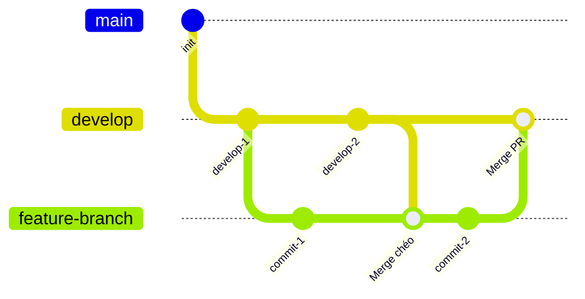
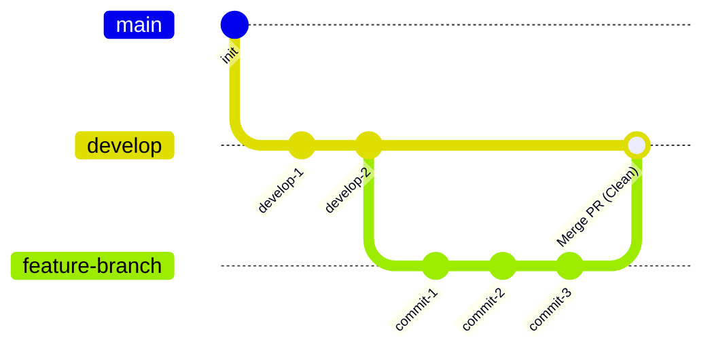

# GIT WORKFLOW GUIDE
## Hướng Dẫn Chuẩn Hóa Git History - Tránh Lỗi Mạng Nhện Đồ Thị (Git Spaghetti Graph)

---

## 1. Vấn Đề: Lỗi Đồ Thị Mạng Nhện (Git Spaghetti Graph)

Khi nhiều lập trình viên cùng phát triển trên các nhánh tính năng (`feature branches`), họ thường có thói quen cập nhật code mới từ nhánh chính bằng cách chạy lệnh `git merge develop` hoặc `git pull origin develop`. 

Hành động này tạo ra các commit merge ngược chéo lẫn nhau giữa nhánh tính năng và nhánh chính, khiến **Git Graph trở nên rối rắm, chằng chịt như mạng nhện và cực kỳ khó theo dõi**.

> [!CAUTION]
> **Nguyên nhân chính gây rối đồ thị**:
> Sử dụng lệnh `git merge develop` (hoặc `git pull` mặc định tạo merge commit chéo) trên nhánh tính năng của bạn trước khi đẩy lên remote.

### So sánh trực quan hai cách tiếp cận:

#### ❌ Cách làm sai (Merge Workflow chéo)
Tạo commit merge lặp đi lặp lại khiến lịch sử đan xen chéo qua lại, rác lịch sử commit:



####  Cách làm đúng (Rebase Workflow chuẩn)
Nhánh của bạn luôn thẳng tắp, bắt nguồn từ đầu `develop` mới nhất. Khi merge PR vào `develop` chỉ tạo duy nhất 1 đường cong song song sạch sẽ:



---

## 2. Hướng Dẫn Quy Trình Chuẩn (Rebase & Non-FF Merge)

Để đảm bảo **giữ nguyên toàn bộ lịch sử commit cá nhân** (không gộp commit) mà đồ thị vẫn sạch đẹp, thẳng tắp và song song:

### Bước 1: Luôn cập nhật code mới bằng REBASE
Mỗi khi nhánh `develop` trên remote có cập nhật mới, thay vì chạy `merge`, bạn hãy thực hiện `rebase` nhánh của mình:

```bash
# 1. Chuyển về nhánh tính năng của bạn
git checkout feature/ten-tinh-nang

# 2. Tải về thông tin mới nhất từ remote
git fetch origin

# 3. Tiến hành rebase nhánh của bạn lên đầu develop mới nhất
git rebase origin/develop
```

> [!WARNING]
> **Xử lý khi xảy ra Conflict trong lúc Rebase**:
> Nếu xảy ra xung đột code, Git sẽ tạm dừng quá trình rebase. 
> 1. Mở các file bị conflict và giải quyết thủ công.
> 2. Đánh dấu đã giải quyết: `git add <file_da_sua>`
> 3. Tiếp tục rebase bằng lệnh: `git rebase --continue`
> 4. *(Tuyệt đối KHÔNG chạy `git commit` trong quá trình rebase)*.
> 
> *Nếu muốn hủy bỏ rebase và quay lại trạng thái ban đầu: `git rebase --abort`*.

---

### Bước 2: Đẩy nhánh lên Remote
Do lịch sử commit của nhánh đã được sắp xếp lại thẳng tắp lên đầu `origin/develop` sau khi Rebase, Git sẽ không cho phép push thông thường. 

Bạn cần dùng cờ `--force-with-lease` để đẩy đè một cách an toàn lên Remote:

```bash
git push origin feature/ten-tinh-nang --force-with-lease
```

> [!TIP]
> Luôn dùng `--force-with-lease` thay vì `--force` để đảm bảo an toàn, tránh vô tình ghi đè commit của đồng nghiệp nếu có ai đó vừa đẩy lên cùng nhánh.

---

### Bước 3: Tạo và Merge Pull Request (PR)

Khi tiến hành merge Pull Request trên trang quản lý Git (GitHub / GitLab / Bitbucket):

1. **Chọn tùy chọn:** **`Create a merge commit`** *(Merge commit thông thường / Non-Fast-Forward Merge)*.
2. **Không chọn:**
   * ❌ **Squash and merge**: Sẽ gộp tất cả commit thành 1, làm mất lịch sử chi tiết từng commit cá nhân.
   * ❌ **Rebase and merge**: Sẽ làm mất vết rẽ nhánh của Pull Request trên đồ thị.

Nhờ có bước Rebase ở local, nhánh của bạn khi merge vào `develop` sẽ tạo thành một nhánh rẽ song song thẳng tắp và chập lại bằng **đúng duy nhất một nút Merge Commit**, loại bỏ hoàn toàn tình trạng đan chéo mạng nhện.

---

## 💡 Quy Tắc Vàng Cần Nhớ

> **"REBASE ở local, MERGE COMMIT ở remote. Tuyệt đối không merge develop vào nhánh tính năng bằng merge chéo!"**
